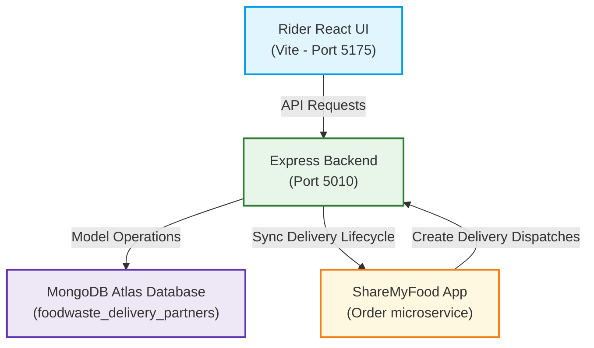
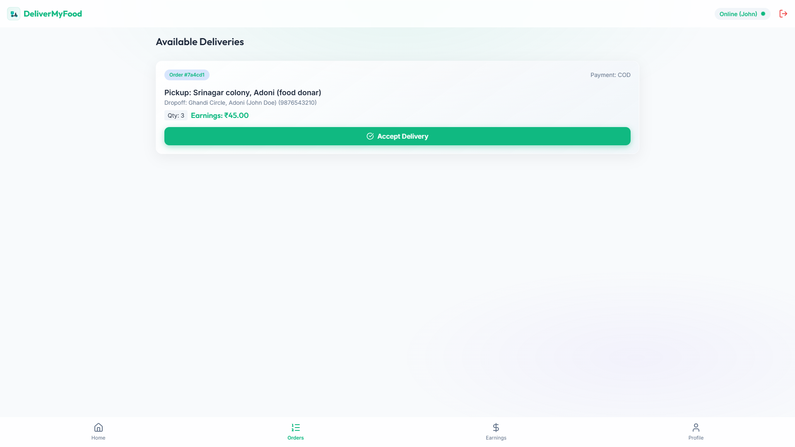
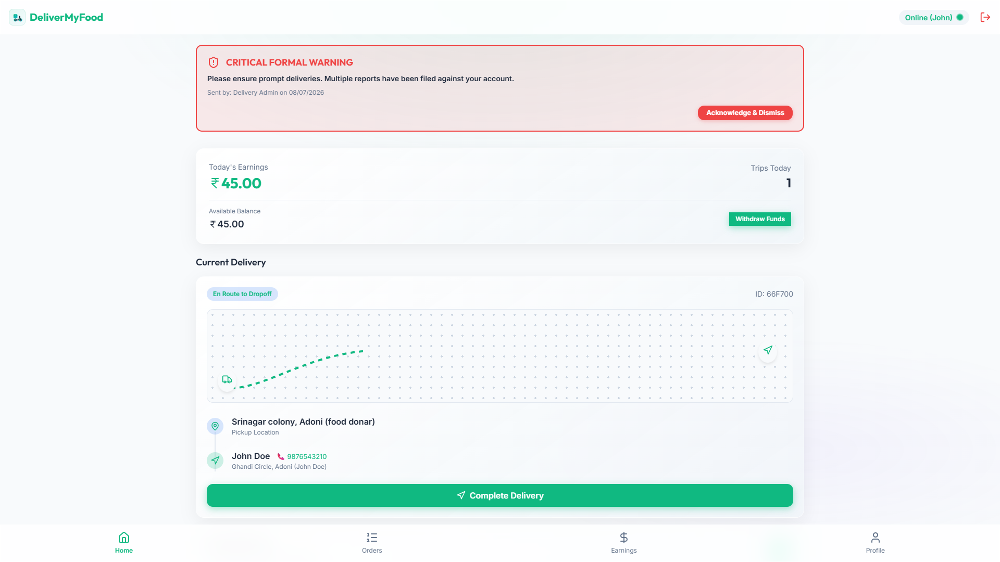
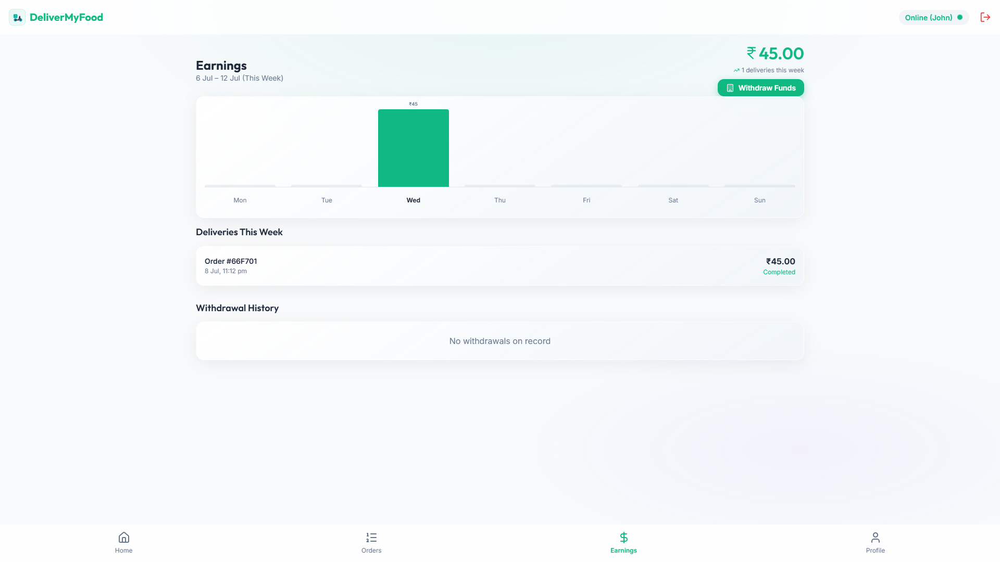
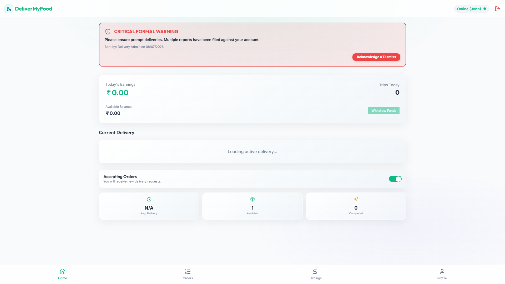
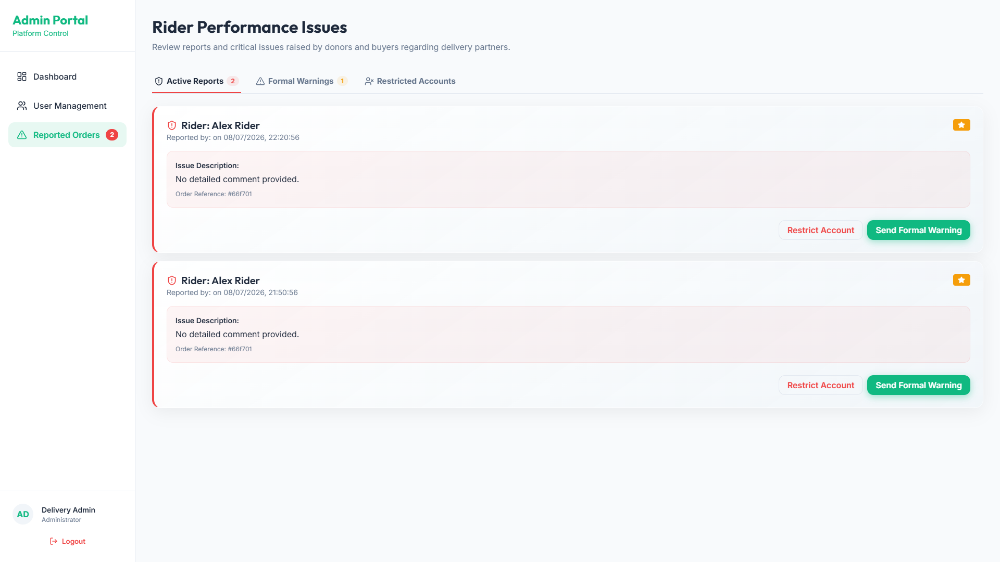

# Deliver My Food 🚚

A MERN Delivery Partner Management Platform Integrated with ShareMyFood for Real-Time Food Delivery Operations.

[](https://reactjs.org/)
[](https://nodejs.org/)
[](https://expressjs.com/)
[](https://www.mongodb.com/)
[](https://jwt.io/)
[](https://vercel.com/)
[](https://render.com/)

---

## 📌 Project Overview

**Deliver My Food** is a production-grade, full-stack logistics and delivery partner application. It serves as the operations and dispatch portal that handles the complete delivery lifecycle for surplus food orders created on the **ShareMyFood** network.

The platform empowers delivery riders to manage their availability, accept live orders, track delivery milestones, and coordinate payouts. Simultaneously, administrators can verify new riders, monitor service quality, and handle customer reports of late or damaged packages.

The system is directly integrated with **ShareMyFood**'s dispatch gateway:

```
ShareMyFood Order Approved ➔ Delivery Request Created ➔ Rider Accepts Delivery ➔ Pickup ➔ Delivered
```

---

## 🏗️ System Architecture & Integration

Deliver My Food is built on a modular client-server architecture. It handles identity management for logistics riders and interacts dynamically with ShareMyFood's main Order microservice to sync delivery requests.



---

## ⚡ Core Features

### 🚚 Rider Features
* **Availability Toggle**: Switch status between online and offline to start or stop receiving nearby order dispatches.
* **Available Feed**: Browse available delivery requests containing pick-up/drop-off addresses and quantities.
* **Delivery Lifecycle Tracking**: Update order status as they progress through milestones:
  ```
  Pending ➔ Accepted ➔ Picked Up ➔ Delivered
  ```
* **Earnings Wallet**: Calculate earnings dynamically (flat rate of ₹45 per delivery), view weekly graphs, and place bank/UPI withdrawal requests.

### ⭐ Rating & Report System
* **Feedback Sync**: Donors and users on the main ShareMyFood application can submit ratings and reports against riders.
* **Duplicate Prevention**: Implements validation logic that prevents duplicate report submissions on the same order.
* **History Tracking**: Tracks full historical report logs under rider profiles to help admins evaluate performance.

### ⚠️ Advanced Warning System
* **Admin Review**: Admins review customer reports and can issue formal warnings.
* **Rider Dashboard Alerts**: Riders receive a critical warning alert on login that blocks access until they acknowledge it.
* **Constraint Validation**: Only **one active warning** is allowed at a time. A new warning can only be issued after the previous warning has been acknowledged.

### 🛡️ Admin Portal
* **Verification Moderation**: Verify new delivery partner registrations and check submitted documents.
* **Account Restriction**: Suspend or delete riders with high report counts or repeated warnings.
* **Quality Assurance**: Inspect ongoing complaints and issue formal warnings.

---

## 📸 Screenshots

### Rider Dashboard (Available Deliveries)


### Active Delivery lifecycle


### Earnings & Withdrawal Wallet


### Warning Notification Modal


### Admin Reports Moderation


---

## 🛠️ Tech Stack

* **Frontend**: React (Vite), Vanilla CSS, Lucide Icons, Axios, React Router DOM
* **Backend**: Node.js, Express.js
* **Database**: MongoDB Atlas, Mongoose ODM
* **Deployment**: Vercel (Frontend), Render (Backend & Databases)

---

## 📂 Project Structure

```text
DeliverMyFood/
├── public/                 # Static public assets
├── screenshots/            # Visual documentation images
├── server/                 # Express backend server files
│   ├── package.json        # Server dependency specifications
│   ├── user-service.js     # Rider auth, profile, and warning management APIs
│   └── users.json          # Seed data backup
├── src/                    # React frontend source code
│   ├── components/         # Reusable layout and navigation components
│   ├── context/            # Auth and Toast state providers
│   ├── pages/              # Dashboard, Orders, Earnings, and Profile pages
│   ├── App.jsx             # Main routing and preloader setup
│   └── index.css           # Core styling system
├── .gitignore              # Git excluded file configurations
├── README.md               # Project documentation
├── vercel.json             # Vercel SPA routing rules
└── vite.config.js          # Vite server port configurations
```

---

## ⚙️ Local Installation & Running

### Step 1: Install dependencies
Install dependencies for both frontend and backend:
```bash
# Install backend server dependencies
cd server && npm install

# Install frontend dependencies
cd .. && npm install
```

### Step 2: Set Environment Variables
The server reads configuration details from environment variables. Set them up before starting:
```env
PORT=5010
MONGO_URI=mongodb://localhost:27017/foodwaste_delivery_partners
JWT_SECRET=your_jwt_signing_key_here
```
*(All production secrets and database URIs are excluded from git logs to ensure compliance).*

### Step 3: Run the Application
1. Start the Backend Server:
   ```bash
   cd server && node user-service.js
   ```
2. Start the Frontend Client:
   ```bash
   cd .. && npm run dev
   ```
Access the application interface in your browser at: **[http://localhost:5175](http://localhost:5175)**.

---

## 🔑 API Specifications

| Endpoint | Method | Description |
| :--- | :---: | :--- |
| `/register` | `POST` | Register a new rider/admin account. |
| `/login` | `POST` | Authenticate accounts and return signed JWT. |
| `/:id` | `GET` | Fetch profile details, verification status, and warnings. |
| `/:id/online-status` | `PUT` | Toggle online availability state. |
| `/:id/withdraw` | `POST` | Request an earnings withdrawal (Bank/UPI). |
| `/:id/feedback` | `POST` | Submit donor/customer rating and report. |
| `/:id/clear-warnings` | `POST` | Acknowledge active warning. |
| `/warn-rider` | `POST` | (Admin) Issue warning to a rider. |
| `/admin/all` | `GET` | (Admin) List all registered riders. |
| `/admin/verifications` | `GET` | (Admin) Manage rider document approvals. |
| `/admin/all-reports` | `GET` | (Admin) Fetch all submitted complaints. |

---

## 🛡️ Security Features

1. **Password Protection**: Hashing algorithms powered by `bcryptjs`.
2. **Auto-Logout checks**: Mount checks checking if account status is marked as `restricted` or `deleted` to instantly terminate JWT sessions.
3. **Admin Controls**: Strict token checks for verification routes and warning issuances.
4. **Input Constraints**: Validation regex checks for bank account numbers, UPI IDs, and IFSC formats during withdrawals.

---

## 🚀 Future Improvements

* **Real-time Location Tracking**: Map telemetry indicating delivery rider paths using Socket.IO.
* **Route Optimization**: Multi-dropoff routing suggestions powered by Mapbox or Google Directions API.
* **Push Notifications**: Firebase Cloud Messaging (FCM) integration for live order dispatch alerts.
* **Mobile Applications**: Flutter or React Native port of the rider portal for background location services.

---

## 👨‍💻 Author

**Gargeya Datta Hotur** - *Full Stack Developer*
* **GitHub**: [@dattahotur](https://github.com/dattahotur)
* **LinkedIn**: [Gargeya Datta Hotur](https://www.linkedin.com/in/gargeya-datta-hotur-7ab80a322)
* **Email**: dattahotur369@gmail.com
